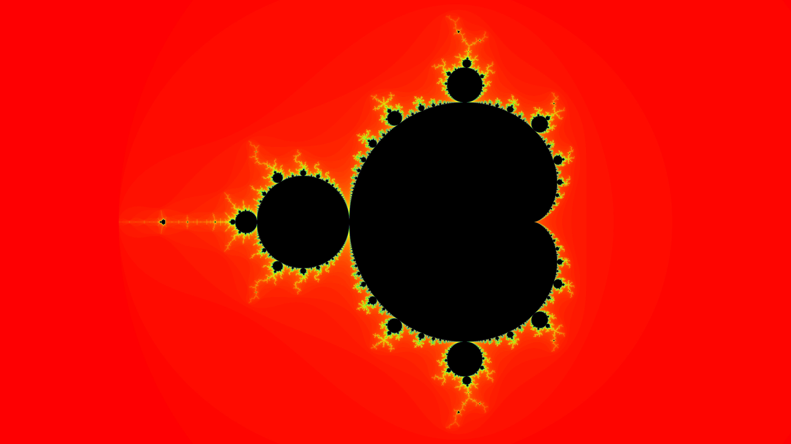

# mandelbrot-julia-sets

  

Consider the recurrence relation $z_{n+1} = z_n^2 + c$ where $c$ is a complex number.
The Mandelbrot set is a fractal, defined by the set of complex numbers $c$ for which this recurrence relation, with initial value $z_0 = 0$, does not diverge$.
Another interesting set related to the Mandelbrot set are Julia sets, which are defined for a specific complex number $c$.
To keep things brief, we will just establish the definition for a filled-in Julia set and do so in the following way:
The filled-in Julia set of a complex number $c$ is the set of initial values $z_0$ for which the previously mentioned recurrence relation does not diverge.
Not every filled-in Julia sets is a fractal, but for almost all complex numbers $c$ they are.

This project contains an implementation for generating images and videos relating to the Mandelbrot set and Julia sets.

  
  

